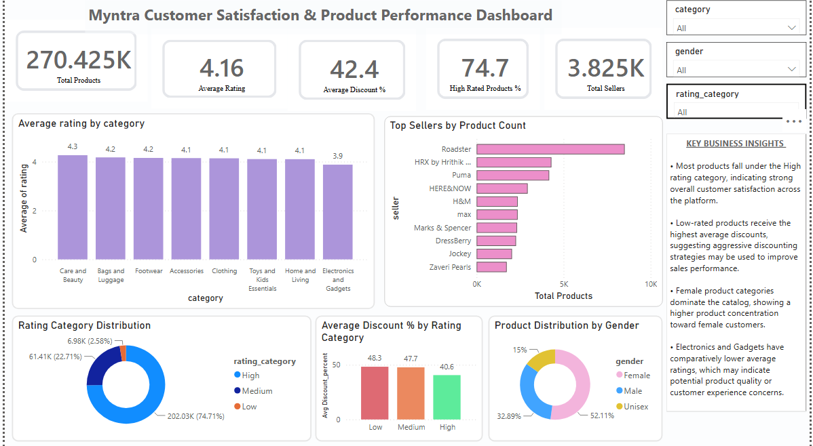

# 🛍️ Myntra Customer Rating Prediction using Machine Learning & Power BI

## 📌 Project Overview

Customer ratings play a vital role in influencing purchasing decisions on e-commerce platforms. This project combines **Power BI** for interactive business analytics and **Machine Learning** for predictive modeling to analyze customer rating patterns and identify the key factors influencing product ratings on Myntra.

The project follows an end-to-end data analytics workflow, including data preprocessing, feature engineering, exploratory data analysis, statistical testing, interactive dashboard development, and predictive modeling using both **Classification** and **Regression** techniques.

---

# 🎯 Business Objectives

- Analyze customer rating patterns across products and sellers.
- Identify significant factors influencing customer ratings.
- Build classification models to predict rating categories.
- Build regression models to predict exact customer ratings.
- Compare multiple machine learning algorithms.
- Generate actionable business recommendations.
- Develop an interactive Power BI dashboard for business users.

---

# 📂 Dataset

**Dataset Size**

- **Rows:** 270,419
- **Original Features:** 13

### Original Features

- Product Name
- Product Image URL
- Price
- MRP
- Rating
- Total Ratings
- Seller
- Product URL
- Category
- Sub-category
- Gender
- Discount Percentage
- Deep Discount Indicator

---

# ⚙️ Feature Engineering

## Feature Extraction

The following features were extracted from the existing data:

| Feature | Source | Purpose |
|----------|--------|---------|
| Category | Sub-category | Derived the main product category |
| Gender | Product Name | Identified the target customer gender |
| Sub-category | Product URL | Extracted product sub-category information |

---

## Engineered Features

| Feature | Description |
|----------|-------------|
| Discount Percentage | Percentage discount calculated from Price and MRP |
| Deep Discount Indicator | Flags products with high discounts |
| Category-Gender | Combines category and gender to capture customer targeting intent |
| Seller Frequency | Number of products listed by each seller |
| Sub-category Frequency | Number of products within each sub-category |
| Rating Category | Converts ratings into Low, Medium, and High categories for classification |

---

# 📊 Power BI Dashboard

An interactive **Power BI dashboard** was developed to explore customer rating trends and business performance.

### Dashboard Highlights

- Product category analysis
- Seller-wise product distribution
- Customer rating distribution
- Price and MRP analysis
- Discount percentage analysis
- Interactive filters and slicers

### Dashboard Preview




# 🔍 Exploratory Data Analysis

EDA was performed to understand the characteristics of the dataset before model development.

### Analysis Performed

- Missing Value Analysis
- Distribution of Numerical Features
- Outlier Detection
- Seller-wise Product Analysis
- Rating vs Total Ratings
- Correlation Analysis

### Key Insights

- Most products received ratings between **4.0 and 4.5**.
- Product prices and MRP showed right-skewed distributions.
- Product popularity varied significantly across sellers.
- Price and MRP exhibited a strong positive correlation.
- Customer ratings showed relatively weak linear correlations with individual numerical variables.

---

# 📈 Statistical Testing

Statistical tests were performed to validate assumptions and identify significant relationships between variables before model development.

| Statistical Test | Purpose |
|------------------|---------|
| **Shapiro-Wilk Test** | Evaluated whether numerical variables followed a normal distribution. |
| **Spearman Rank Correlation** | Measured monotonic relationships between numerical variables since the data was not normally distributed. |
| **Chi-Square Test** | Assessed the association between categorical variables and the customer rating category. |

### Key Findings

- Numerical variables were **not normally distributed**.
- Therefore, **Spearman Rank Correlation** was used instead of Pearson Correlation.
- Chi-Square testing identified statistically significant categorical predictors for customer rating classification.

---

# 🤖 Machine Learning Models

## Classification Models

- Logistic Regression
- Decision Tree Classifier
- Random Forest Classifier
- XGBoost Classifier

---

## Regression Models

- Linear Regression
- Decision Tree Regressor
- Random Forest Regressor
- XGBoost Regressor

---

# 📈 Model Performance

## Classification Results

| Model | Accuracy | Precision | Recall | F1 Score | ROC AUC |
|--------|---------:|----------:|--------:|---------:|--------:|
| Logistic Regression | 75.10% | 56.42% | 75.10% | 64.43% | 0.579 |
| Decision Tree | 75.47% | 76.17% | 75.47% | 75.79% | 0.699 |
| ⭐ Random Forest | **80.55%** | **78.97%** | **80.55%** | **79.21%** | **0.843** |
| XGBoost | 76.29% | 72.22% | 76.29% | 69.32% | 0.787 |

---

## Regression Results

| Model | MAE | RMSE | R² Score |
|--------|-----:|------:|---------:|
| Linear Regression | 0.361 | 0.500 | 0.025 |
| Decision Tree | 0.310 | 0.534 | -0.113 |
| ⭐ Random Forest | **0.272** | **0.415** | **0.328** |
| XGBoost | 0.325 | 0.456 | 0.191 |

---

# 🌟 Feature Importance

Feature importance analysis was performed using the best-performing **Random Forest** models.

### Most Important Features

- Total Ratings (`ratingTotal`)
- Seller Frequency
- Discount Percentage
- Price
- MRP

These results indicate that **customer engagement and pricing-related features** are the primary drivers of customer ratings.

---

# 📌 Classification vs Regression

| Classification | Regression |
|----------------|------------|
| Predicts customer rating category | Predicts exact customer rating |
| Best Model: Random Forest Classifier | Best Model: Random Forest Regressor |
| Accuracy: **80.55%** | R² Score: **0.328** |

Both approaches consistently identified similar key predictors, demonstrating the importance of customer engagement and pricing features.

---

# 💼 Business Recommendations

- Monitor products predicted to receive low ratings.
- Improve pricing strategies for heavily discounted products.
- Prioritize inventory from consistently high-performing sellers.
- Track seller performance using customer rating trends.
- Use predictive models to proactively identify products requiring quality improvements.

---

# 🛠️ Technologies Used

- Python
- Power BI
- Pandas
- NumPy
- Matplotlib
- Scikit-learn
- XGBoost
- SciPy
- Jupyter Notebook

---

# 📁 Repository Structure

```
Myntra-Customer-Rating-Prediction/
│
├── README.md
├── requirements.txt
├── Myntra_Customer_Rating_Prediction.ipynb
├── Myntra_Dashboard.pbix
│
├── data/
│   └── myntra_dataset.csv
│
└── images/
    ├── powerbi_dashboard.png
    ├── correlation_heatmap.png
    ├── classification_scorecard.png
    ├── regression_scorecard.png
    ├── feature_importance_classifier.png
    └── feature_importance_regressor.png
```

---


---

# 🔮 Future Improvements

- Hyperparameter tuning using GridSearchCV
- Explainable AI using SHAP
- Model deployment using Streamlit
- Real-time customer rating prediction
- Recommendation system integration

---


## 👩‍💻 Author

**Sahithi Vittal**

- 📧 Email: sahithi.vittal@gmail.com
- 💼 LinkedIn: (https://www.linkedin.com/in/vittal-sahithi/)

---

## ⭐ If you found this project useful, consider giving it a star!
